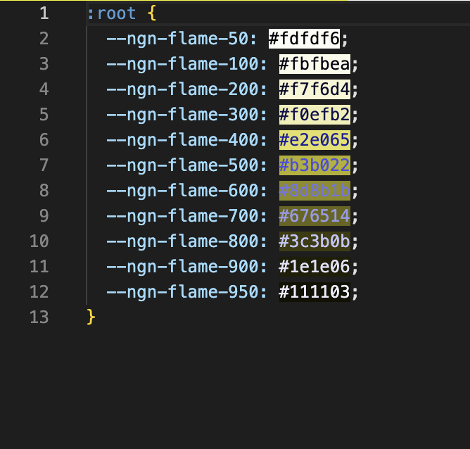

# monaco editor hex color highlight decorator example

This example demonstrates a custom decorator feature with highlighting hex color code strings. This decorator is modify background and foreground color of hex color codes. Also, inverted foreground color helps to read decodarated contents.

## [⚡️ Play on Stackblitz](https://stackblitz.com/~/github.com/monaco-editor-trials/hex-color-highlight-decorator)

## 🌟 Preview

